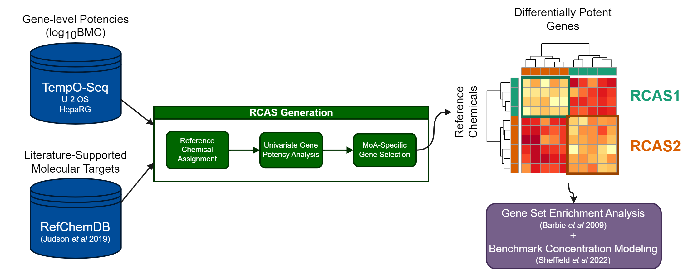

Extraction and analyis of Reference Class Associated Signatures (RCAS)
using U-2 OS and HepaRG chemical screening data. RCAS represent
unique gene sets more potent for individual classes of chemicals versus
those annotated for other modes-of-action.

Genes are selected by comparing benchmark doses (BMDs) as potency estimates
across classes of reference chemicals assigned to similar modes-of-action, and
genes uniquely potent for individual reference classes are selected as part of a
signature for that class:



# Setup Environment

```{r env-setup, message=FALSE}
# import packages for visualization
# (note that other required packages will be imported by R scripts)
library(ggplot2)
library(ComplexHeatmap)
library(RColorBrewer)
library(circlize)

# set directories (`dir_home` should be set to the top-level directory)
dir_home <- "~/NAM-integration/NAM-integration-pilot-packaged/"
dir_scripts <- paste0(dir_home, "scripts/")
setwd(dir_home)

# import scripts for RCAS generation and profiling
source(paste0(dir_scripts, "pipeline_refchem_assignment.R"))
source(paste0(dir_scripts, "pipeline_RCAS_generation.R"))
source(paste0(dir_scripts, "pipeline_RCAS_profiling.R"))

path_rcas <- c(
  paste0(dir_home, "data/examples/rcas_heparg_gene_bnd.RData"),
  paste0(dir_home, "data/examples/rcas_u2os_gene_bnd.RData")
)

th <- theme(text = element_text(family = "Helvetica"))
```

# Assign Reference Chemicals

Reference classes are developed using
[RefChemDB](https://doi.org/10.1186/s13040-022-00292-z) by
assigning chemicals to clusters of target-mode combinations. Chemicals are
assigned using a rule-based procedure:

-   Hierarchically cluster target_mode entries based on Jaccard distance 
    -   Determine clusters using a dendrogram height cutoff of 0.8 
-   For each chemical, count the number of target_mode entries that belong to 
each cluster 
-   Assign chemical to cluster with highest count 
    -   Settle ties using total support for each cluster (sum(support) for all 
target_mode entries in a cluster) 
    -   Remove remaining ties (equal target representation and support) 
-   Remove clusters with <3 chemicals assigned
-   Cluster labels assigned based on most frequent target_mode entries within
each cluster

```{r assign-refchems}
# assign reference chemicals from RefChemDB and export to file
path_refchems <- paste0(dir_home, "data/examples/refchemdb_clusters.RData")
if (!file.exists(path_refchems)) {
  refchem_assign <- assignRefChems(path_refchems)
} else {
  load(path_refchems)
}

# summarize chemicals represented by clusters
refchem_assign %>%
  count(cluster, cluster_target) %>%
  arrange(desc(n)) %>%
  DT::datatable()
```

# Generate RCAS

Gene sets are generated for reference classes using High-Throughput
Transcriptomics (HTTr) screening data of 1,201 chemicals in U-2 OS and 
HepaRG cell lines. Gene-level potency estimates were previously generated from
DESeq2-moderated fold changes using the `httrpathway` package
[available on USEPA Github](https://github.com/USEPA/CompTox-httrpathway), and 
are used as the basis for determining gene sets.

## Conduct univariate potency analysis

`analyzeHTTrANOVA()` can take some time to run if many significant
genes are found (compiling HepaRG-based RCAS below takes ~10 minutes). Here, 
RCAS objects are pre-generated and saved in the `data/examples` directory.

```{r generate-rcas, eval=FALSE}
# specify paths for httr gene-level potency estimates
path_httr <- c(
  "/ccte/projects1/HTTr/screen_gene_cr/GENE_CR_heparg2d_toxcast_pfas_pe1_normal_0.05_conthits.RData",
  "/ccte/projects1/HTTr/screen_gene_cr/GENE_CR_u2os_toxcast_pfas_pe1_normal_0.05_conthits.RData"
)

# generate RCAS for each dataset
rcas_heparg <- analyzeHTTrANOVA(
  filepath.data = path_httr[1],
  filepath.ref = path_refchems,
  col.httr.type = "gene",
  col.ref.class = "cluster_target",
  metric.fill = 2.5,
  bmd.low.bnd = 0.1,
  bmd.up.bnd = 10
)
save(rcas_heparg, file = path_rcas[1])

rcas_u2os <- analyzeHTTrANOVA(
  filepath.data = path_httr[2],
  filepath.ref = path_refchems,
  col.httr.type = "gene",
  col.ref.class = "cluster_target",
  metric.fill = 2.5,
  bmd.low.bnd = 0.1,
  bmd.up.bnd = 10
)
save(rcas_u2os, file = path_rcas[2])

# display results for significant genes: U-2 OS
rcas_u2os$posthoc.estimate$posthoc.sig %>%
    mutate(across(where(is.numeric), ~ signif(.x, 3))) %>%
    DT::datatable()
```

## Select final RCAS genes

Following ANOVA-based potency comparisons per gene, final gene sets are
constructed for each reference class by selecting genes whose BMD values are
significantly lower for a single class versus at least 70% of other classes.
RCAS are retained for each target if at least 10 genes meet this criterion.

Note that this selection step is performed within `profileRCAS()` and is done
here for visualizing RCAS sizes/potencies.

```{r compile-rcas}
# perform RCAS selection for each object
composite_heparg <- selectRCASGenes(path_rcas[1])
composite_u2os <- selectRCASGenes(path_rcas[2])

# combine rcas for each cell type
composite_all <- rbind(
  mutate(
    composite_heparg$composite,
    source = "heparg",
    n_classes = length(unique(composite_heparg$httr.wide$ref_class))
  ),
  mutate(
    composite_u2os$composite,
    source = "u2os",
    n_classes = length(unique(composite_u2os$httr.wide$ref_class))
  )
)

# compare sizes of retained RCAS
composite_all %>%
  count(source, class_1) %>%
  rename(class = class_1, size = n) %>%
  DT::datatable()
```

## Compare reference chemicals used for RCAS generation

```{r refchem-rcas}
# combine u2os + heparg lists of refchems used in rcas
refchem_heparg <- composite_heparg$httr.wide %>%
  select(name, dtxsid, ref_class) %>%
  mutate(source = "heparg")
refchem_u2os <- composite_u2os$httr.wide %>%
  select(name, dtxsid, ref_class) %>%
  mutate(source = "u2os")

combined_refchem <- rbind(refchem_heparg, refchem_u2os)

# summarize reference chemicals by cell line and target
plot_refchem <- combined_refchem %>%
  count(source, ref_class) %>%
  ggplot(aes(n, reorder(ref_class, n), label = n)) +
  geom_col(color = "white") +
  geom_text(nudge_x = 1, family = "Helvetica") +
  facet_wrap(~source) +
  labs(x = "Number of Reference Chemicals", y = "Molecular Target") +
  theme_bw() +
  th
ggsave(
  "output/FigS1.png", plot_refchem,
  width = 960, height = 720, units = "px", scale = 2, bg = "white"
)
```

## Compare RCAS gene-level potency estimates

```{r ht-fcn, class.source = 'fold-hide'}
plotHeatmap <- function(rcas, title, composite, width = 8, height = 8) {
  if (is.data.frame(composite) & title %in% composite$source) {
    rcas.vars <- composite %>%
      filter(source == title) %>%
      pull(variable)
    rcas.vars <- gsub("\`", "", rcas.vars)
    rcas.varclass <- composite %>%
      filter(source == title) %>%
      pull(class_1)
    # get classes/chems with passing variables
    rcas.classes.unique <- composite %>%
      filter(source == title) %>%
      pull(class_1) %>%
      unique()
    rcas.names <- rcas$httr.wide %>%
      filter(ref_class %in% rcas.classes.unique) %>%
      pull(name)
    rcas.classes <- rcas$httr.wide %>%
      filter(ref_class %in% rcas.classes.unique) %>%
      pull(ref_class)
    # filter log(bmd) data for variables + chems
    rcas.mat <- rcas$httr.wide %>%
      filter(ref_class %in% rcas.classes.unique) %>%
      select(any_of(rcas.vars)) %>%
      as.matrix()
    rownames(rcas.mat) <- rcas.names
  } else {
    rcas.vars <- rcas$posthoc.estimate$posthoc.vars
    rcas.vars <- gsub("\`", "", rcas.vars)

    rcas.mat <- rcas$httr.wide %>%
      select(any_of(rcas.vars)) %>%
      as.matrix()
    rcas.classes.unique <- unique(rcas$httr.wide$ref_class)
    rcas.names <- rcas$httr.wide$name
    rcas.classes <- rcas$httr.wide$ref_class
    rownames(rcas.mat) <- stringr::str_trunc(rcas.names, 20)
  }
  # construct annotation color palette
  rcas.palette <- colorRampPalette(
    brewer.pal(8, "Set2")
  )(length(unique(composite$class_1)))
  names(rcas.palette) <- unique(composite$class_1)
  # plot heatmap
  title_label <- ifelse(title == "heparg", "HepaRG", "U-2 OS")
  rcas.ht <- Heatmap(
    rcas.mat,
    colorRamp2(c(-2.5, -1.25, 0, 1.25, 2.5), rev(brewer.pal(5, "Spectral"))),
    name = paste0("log10(BMC)"),
    column_title = paste0("RCAS-Identified Genes: ", title_label),
    column_title_gp = gpar(fontsize = 8),
    row_title = "Reference Chemical",
    row_title_gp = gpar(fontsize = 8),
    left_annotation = rowAnnotation(
      reference_class = rcas.classes,
      col = list(reference_class = rcas.palette),
      show_annotation_name = FALSE,
      annotation_legend_param = list(
        reference_class = list(direction = "horizontal", nrow = 2)
      ),
      simple_anno_size = unit(0.3, "cm")
    ),
    top_annotation = HeatmapAnnotation(
      variable_class = rcas.varclass,
      col = list(variable_class = rcas.palette),
      show_annotation_name = FALSE,
      show_legend = FALSE,
      simple_anno_size = unit(0.3, "cm")
    ),
    row_split = rcas.classes,
    column_labels = rep("", ncol(rcas.mat)),
    row_names_gp = gpar(fontsize = 7),
    heatmap_legend_param = list(
      direction = "horizontal",
      at = seq(-3, 3, 1)
    ),
    width = unit(width, "cm"),
    height = unit(height, "cm")
  )
  return(rcas.ht)
}
```

```{r compare-gene-potency}
# rename select refchems to common names
rename_dtxsids <- c("DTXSID8023474", "DTXSID6040745", "DTXSID9040760")
rename_names <- c("Pimozide", "L-165041", "GW0742")
for (idx in seq_len(length(rename_dtxsids))) {
  composite_heparg$httr.wide$name[composite_heparg$httr.wide$dtxsid == rename_dtxsids[idx]] <- rename_names[idx]
  composite_u2os$httr.wide$name[composite_u2os$httr.wide$dtxsid == rename_dtxsids[idx]] <- rename_names[idx]
}
# plot heatmaps
ht_heparg <- plotHeatmap(
  composite_heparg, "heparg", composite_all, width = 3.6, height = 3.4
)
draw(ht_heparg, merge_legend = TRUE, heatmap_legend_side = "bottom")
ht_u2os <- plotHeatmap(
  composite_u2os, "u2os", composite_all, width = 3.6, height = 3
)
draw(ht_u2os, merge_legend = TRUE, heatmap_legend_side = "bottom")
```

## Compare overlap of genes across RCAS

```{r compare-overlap}
# get unique rcas for each gene
composite_overlap <- composite_all %>%
  mutate(rcas = paste0(source, "_", class_1)) %>%
  group_by(variable) %>%
  summarise(rcas_list = list(rcas))

plot_overlap <- ggplot(composite_overlap, aes(x = rcas_list)) +
  geom_bar() +
  ggupset::scale_x_upset() +
  geom_text(stat = "count", aes(label = ..count..), family = "Helvetica", vjust = -1) +
  scale_y_continuous(limits = c(0, 600)) +
  labs(x = "RCAS", y = "# Genes") +
  theme_bw() +
  th +
  ggupset::theme_combmatrix(combmatrix.label.text = element_text(family = "Helvetica")) +
  theme(plot.margin = unit(c(0.5, 0.5, 0.5, 3), "cm"))
ggsave(
  "output/FigSX.png", plot_overlap,
  width = 960, height = 720, units = "px", scale = 2, bg = "white"
)
```


# Profile RCAS

Resulting RCAS for each reference class are subsequently used to profile
targeted bioactivitiy across all 1,201 chemicals screened in U-2 OS/HepaRG
cell lines. Signature-level profiling is conducted using `httrpathway`, which
performs ssGSEA  ([Barbie et al. 2009](https://doi.org/10.1038/nature08460))
for each chemical-dose group for each RCAS and subsequently conducts
concentration profiling for each chemical and RCAS via the `tcplfit2` package
([Sheffield et al 2022](https://doi.org/10.1093/bioinformatics/btab779)).

Notes:

-   Current scripts assume access to the HTTr internal EPA mongodb for accessing log2(fold-change) data. Future versions of this data may be hosted on Clowder as flat files and available for public use.
  -   For mongodb access, user credentials shold be stored in user's home directory under `~/.mongopw`, following a json structure per study.
  -   Current scripts also assume installation of the `httrlib` package (currently available for internal use only). Alternatively, these functions can be sourced from the httrpathway cloned repository using `source("../httrpathway/httrpl/Rlib/httrpl.R", chdir = TRUE)`.
-   **Import and processing of log2(fold-change) data will take a long time (1-1.5 hours per dataset)**

```{r profile-rcas, eval=FALSE}
# define mongodb connection and export args
db_host <- "ccte-mongodb-res.epa.gov"
db_names <- c(
  "res_httr_heparg2d_toxcast",
  "res_httr_u2os_toxcast"
)
fc1_names <- c(
  "heparg_fc1_rcas.RData",
  "u2os_fc1_rcas.RData"
)
catalog_names <- c(
  "signatureDB_rcas_heparg.xlsx",
  "signatureDB_rcas_u2os.xlsx"
)

# run RCAS profiling per cell type
profileRCAS(
  filepath_rcas = path_rcas[1],
  db_host = db_host,
  db_name = db_names[1],
  fc1_name = fc1_names[1],
  random_sigs = TRUE,
  catalog_name = catalog_names[1]
)
profileRCAS(
  filepath_rcas = path_rcas[2],
  db_host = db_host,
  db_name = db_names[2],
  fc1_name = fc1_names[2],
  random_sigs = TRUE,
  catalog_name = catalog_names[2]
)
```

## Compare RCAS signature-level potency estimates

Signature-level curve fits are extracted for all chemicals used in RCAS
generation for comparison of potency/efficacy estimates. Estimates are 
compared between in-class chemicals (i.e. reference class matches RCAS) and
out-of-class chemicals (i.e. reference class does not match RCAS) as validation
of performance of signature-level profiling against the reference set.

```{r compare-signature-potency}
# import RCAS signature results
dir_cr <- "~/NAM-integration/output/signature_conc_resp_summary/"
db_names <- c(
  "res_httr_heparg2d_toxcast",
  "res_httr_u2os_toxcast"
)
files_cr <- paste0("SIGNATURE_CR_rcas_", db_names, "_gsea_0.05_conthits.RData")
load(paste0(dir_cr, files_cr[1]))
cr_heparg <- SIGNATURE_CR
load(paste0(dir_cr, files_cr[2]))
cr_u2os <- SIGNATURE_CR
rm(SIGNATURE_CR)

# combine results across cell types + filter for reference chemicals
cr_all <- rbind(
  mutate(cr_heparg, source = "heparg"),
  mutate(cr_u2os, source = "u2os")
)
cr_refchems <- rbind(
  filter(
    mutate(cr_heparg, source = "heparg"),
    dtxsid %in% composite_heparg$ref$dtxsid
  ),
  filter(
    mutate(cr_u2os, source = "u2os"),
    dtxsid %in% composite_u2os$ref$dtxsid
  )
) %>%
  mutate(ref_class = composite_heparg$ref$ref_class[
    match(dtxsid, composite_heparg$ref$dtxsid)
  ])

# annotate results with in-class/out-of-class + bioactivity classifications
cr_refchems <- cr_refchems %>%
  mutate(
    signature = gsub("_up|_dn", "", signature),
    bmd_log = case_when(!is.na(bmd) ~ log10(bmd), TRUE ~ 2.5),
    toc_signed = top_over_cutoff * sign(top),
    pass_bioactivity = hitcall >= 0.9 & top_over_cutoff >= 1.5,
    source_signature = paste0(source, "_", signature),
    in_class = ref_class == signature
  )


# visualize potency/efficacy for each class
for (idx in seq_len(length(rename_dtxsids))) {
  cr_refchems$name[cr_refchems$dtxsid == rename_dtxsids[idx]] <- rename_names[idx]
}
plot_pot_eff <- cr_refchems %>%
  filter(!grepl("Random", signature)) %>%
  ggplot(aes(
    bmd_log, toc_signed,
    color = in_class,
    shape = pass_bioactivity,
    label = stringr::str_trunc(name, 30)
  )) +
  geom_point(alpha = 0.8, size = 1.5) +
  geom_hline(yintercept = 0, color = "grey50") +
  geom_hline(
    yintercept = c(-1.5, 1.5),
    linetype = "dashed", color = "grey50"
  ) +
  scale_shape_manual(values = c(3, 16)) +
  scale_color_brewer(palette = "Set1") +
  facet_wrap(~source_signature) +
  labs(
    x = "log10(BMC)", y = "Signed Top Over Cutoff",
    color = "Chemical in\nReference\nClass",
    shape = "Passed\nBioactivity\nThresholds",
    title = ""
  ) +
  theme_bw() +
  th +
  theme(legend.direction = "vertical")

plot_pot_eff
```

```{r plot-figure, class.source = 'fold-hide'}
# import rcas schematic
sch_rcas <- png::readPNG(paste0(dir_home, "vignettes/Fig1A.png"))
sch_rcas_grob <- rasterGrob(sch_rcas)

# generated combined legends for heatmaps
rcas_palette <- colorRampPalette(
  brewer.pal(8, "Set2")
)(length(unique(composite_all$class_1)))
names(rcas_palette) <- unique(composite_all$class_1)
lgd_ref <- Legend(
  at = names(rcas_palette),
  title = "Molecular Target",
  legend_gp = gpar(fill = unname(rcas_palette)),
  labels_gp = gpar(fontsize = 7, fontfamily = "Helvetica"),
  title_gp = gpar(fontsize = 8, fontfamily = "Helvetica", fontface = "bold"),
  ncol = 2
)
lgd_bmd <- Legend(
  at = seq(-3, 3, 1),
  title = "log10(BMC)",
  col_fun = colorRamp2(
    c(-2.5, -1.25, 0, 1.25, 2.5), rev(brewer.pal(5, "Spectral"))
  ),
  labels_gp = gpar(fontsize = 7, fontfamily = "Helvetica"),
  title_gp = gpar(fontsize = 8, fontfamily = "Helvetica", fontface = "bold"),
  direction = "horizontal"
)

# plot combined panels (Figure 1)
png(
  filename = paste0(dir_home, "output/Fig1.png"),
  width = 2000, height = 2400, units = "px", res = 300
)
grid::pushViewport(viewport(
  x = 0, y = 0.7, width = 1, height = 0.3, just = c("left", "bottom")
))
grid::grid.raster(sch_rcas)
grid::popViewport()
grid::pushViewport(grid::viewport(
  x = 0.1, y = 0.45, width = 0.3, height = 0.2, just = c("left", "bottom")
))
draw(
  ht_heparg,
  merge_legend = TRUE, show_heatmap_legend = FALSE, newpage = FALSE
)
grid::popViewport()
grid::pushViewport(grid::viewport(
  x = 0.1, y = 0.17, width = 0.3, height = 0.2, just = c("left", "bottom")
))
draw(
  ht_u2os,
  merge_legend = TRUE, show_heatmap_legend = FALSE, newpage = FALSE
)
grid::popViewport()
grid::pushViewport(grid::viewport(
  x = 0.1, y = 0.08, width = 0.3, height = 0.05, just = c("left", "bottom")
))
draw(lgd_ref)
grid::popViewport()
grid::pushViewport(grid::viewport(
  x = 0.1, y = 0.01, width = 0.3, height = 0.05, just = c("left", "bottom")
))
draw(lgd_bmd)
grid::popViewport()
grid::pushViewport(grid::viewport(
  x = 0.5, y = 0, width = 0.5, height = 0.7, just = c("left", "bottom")
))
grid::grid.draw(
  ggplotGrob(
    plot_pot_eff +
      facet_wrap(~source_signature, ncol = 1) +
      theme(
        strip.text.x = element_text(size = 8),
        axis.title = element_text(size = 8),
        # legend.position = "bottom",
        legend.title = element_text(size = 8),
        legend.text = element_text(size = 7)
      )
  )
)
grid::popViewport()
grid::grid.text("A", x = 0.02, y = 0.98, gp = gpar(fontface = "bold", fontfamily = "Helvetica"))
grid::grid.text("B", x = 0.02, y = 0.68, gp = gpar(fontface = "bold", fontfamily = "Helvetica"))
grid::grid.text("C", x = 0.02, y = 0.38, gp = gpar(fontface = "bold", fontfamily = "Helvetica"))
grid::grid.text("D", x = 0.52, y = 0.68, gp = gpar(fontface = "bold", fontfamily = "Helvetica"))
dev.off()
```

## Conduct randomization test

Because limited numbers of reference chemicals preclude the use of 
cross-validation for signature validation, a randomization test is
used to test the ability of each reference signature to discern in-class
reference chemicals compared to a series of randomly-generated signatures.

Random signatures were generated from all RCAS genes in each cell type, and
signature BMDs were estimated via the `httrpathways` package. 
Here, random signature BMDs are are used to create a null distribution, and 
RCAS BMDs are compared to the null for each reference chemical using these
steps:

- Identify in-class and out-of-class reference chemicals for each RCAS
- Calculate mean RCAS log10(BMD) for in-class and out-of-class chemicals
- Calculate mean random signature log10(BMD) for respective chemicals
    - Repeated for each individual random signature
- Calculate difference in means between in-class and out-of-class chemicals
    - Repeated for each reference signature all random signatures
- Calculate the probability that a random signature has a greater test statistic than the RCAS (p-value)

```{r randomization-test, class.source = 'fold-hide'}
# for each RCAS, calculate the difference in means between
# in-class and out-of-class chemicals

# set.seed()
calcRandomizationTest <- function(
    cr_refchems, bioactive_only = FALSE, downsample = FALSE) {
  set.seed(NULL)
  # initialize storage objects
  p.randomtest <- c()
  df.randomtest <- data.frame()
  df.sigtest <- data.frame()

  # if bioactive_only flag, filter httr data to bioactive signatures only
  if (bioactive_only) {
    cr_refchems <- filter(cr_refchems, pass_bioactivity)
  }

  for (sig in unique(cr_refchems$source_signature[!grepl("Random", cr_refchems$signature)])) {
    celltype <- gsub("_.*", "", sig)
    # get in-class/out-of-class chems for rcas
    chems.inclass <- cr_refchems %>%
      filter(source_signature == sig & in_class) %>%
      pull(dtxsid) %>%
      unique()
    chems.outofclass <- cr_refchems %>%
      filter(source_signature == sig & !in_class) %>%
      pull(dtxsid)
    if (downsample) {
      chems.outofclass <- sample(chems.outofclass, length(chems.inclass) * 3)
    }
    # calculate difference in means for rcas bmds
    mean.inclass <- cr_refchems %>%
      filter(source_signature == sig & in_class) %>%
      pull(bmd_log) %>%
      mean()
    mean.outofclass <- cr_refchems %>%
      filter(source_signature == sig & !in_class) %>%
      pull(bmd_log) %>%
      mean()
    mean.difference.refsig <- mean.inclass - mean.outofclass

    # calculate differences in means for random signature bmds
    mean.inclass <- cr_refchems %>%
      filter(
        grepl("Random", signature) &
          dtxsid %in% chems.inclass &
          source == celltype
      ) %>%
      group_by(signature) %>%
      summarise(mean_bmd = mean(bmd_log)) %>%
      pull(mean_bmd)
    mean.outofclass <- cr_refchems %>%
      filter(
        grepl("Random", signature) &
          dtxsid %in% chems.outofclass &
          source == celltype
      ) %>%
      group_by(signature) %>%
      summarise(mean_bmd = mean(bmd_log)) %>%
      pull(mean_bmd)
    mean.difference.random <- mean.inclass - mean.outofclass
    # calculate probability that rcas difference in means exceeds
    # random sig difference in means
    exceed.count <- length(mean.difference.refsig[
      abs(mean.difference.random) >= abs(mean.difference.refsig)
    ])
    p.random <- exceed.count / length(mean.difference.random)
    p.randomtest[[sig]] <- p.random

    # save data to dataframes for visualization
    df.randomtest <- rbind(
      df.randomtest,
      data.frame(
        source_signature = sig,
        mean_diff = mean.difference.random
      )
    )
    df.sigtest <- rbind(
      df.sigtest,
      data.frame(
        source_signature = sig,
        mean_diff = mean.difference.refsig,
        pval = p.random
      )
    )
  }
  return(
    list(
      random = df.randomtest,
      rcas = df.sigtest,
      pval = p.randomtest
    )
  )
}
randomtest <- calcRandomizationTest(cr_refchems, downsample = TRUE)
randomtest$rcas <- randomtest$rcas %>%
  mutate(pval_label = case_when(
    pval == 0 ~ paste0("p < ", nrow(randomtest$rcas) / nrow(randomtest$random)),
    TRUE ~ paste0("p = ", pval)
  ))
```

```{r randomization-summary}
# visualize difference in means of reference signatures compared to null
# distributions
plot_randomtest <- ggplot() +
  geom_histogram(
    data = randomtest$random,
    aes(mean_diff), binwidth = 0.1
  ) +
  geom_vline(
    data = randomtest$rcas, aes(xintercept = mean_diff),
    linetype = "dashed", color = "#f03406ef"
  ) +
  geom_text(
    data = randomtest$rcas, aes(x = -3.5, y = 40, label = pval_label),
  ) +
  facet_wrap(~source_signature) +
  labs(
    x = "Mean in-class log10(BMD) -\nMean out-of-class log10(BMD)",
    y = "Frequency of Random Signatures"
  ) +
  theme_bw()
plot_randomtest

# bootstrap randomization test 100x for downsampling
df.randomp <- data.frame()
for (idx in 1:100) {
  randomtest <- calcRandomizationTest(cr_refchems, downsample = TRUE)
  df.p <- as.data.frame(randomtest$pval)
  colnames(df.p) <- "pval"
  df.p$idx <- idx
  df.p$signature <- rownames(df.p)
  rownames(df.p) <- NULL
  df.randomp <- rbind(df.randomp, df.p)
}
df.randomp %>%
  group_by(signature) %>%
  summarise(
    across(pval, list(min = min, mean = mean, median = median, max = max))
  ) %>%
  DT::datatable()
```

# Reproducibility

```{r export-refchems}
# filter refchems for targets in rcas + export to file (Table S1)
refchem_export <- composite_heparg$ref %>%
  filter(
    ref_class %in% unique(c(
      unique(composite_heparg$httr.wide$ref_class),
      unique(composite_u2os$httr.wide$ref_class)
    ))
  ) %>%
  mutate(
    in_httr = dtxsid %in% unique(c(
      unique(composite_heparg$httr.wide$dtxsid),
      unique(composite_u2os$httr.wide$dtxsid)
    ))
  )
openxlsx::write.xlsx(refchem_export, "output/TableS1.xlsx")
```

```{r export-rcas}
rcas_export <- composite_all %>%
  mutate(rcas = paste0(source, "_", class_1)) %>%
  rename(gene = variable) %>%
  select(rcas, gene, mean_bmd_log, mean_bmd_diff, n_sig, prop_sig)

openxlsx::write.xlsx(rcas_export, "output/TableS2.xlsx")
```

```{r reproducibility}
sessionInfo()
```