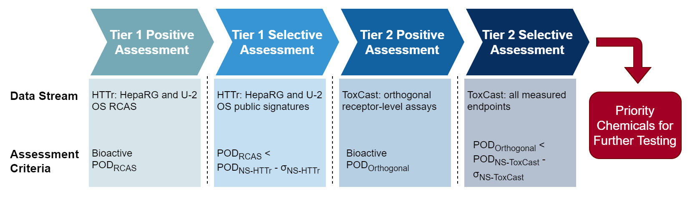

Assessment of current chemical screening data using a tiered NAM-based
framework to prioritize chemicals that perturb key molecular targets.

Chemicals are screened in Tier 1 using
[Reference Class Associated Signatures(RCAS)](analysis_RCAS.Rmd),
initially for bioactivity (Tier 1-Positive) and additionally for selectivity
versus non-targeted transcriptional responses (Tier 1-Selective). Chemicals
with sufficient evidence of targeted behavior in Tier 1 are advanced
to confirmatory Tier 2 assays from the
[US EPA ToxCast program](https://www.epa.gov/chemical-research/exploring-toxcast-data)
using bioactivity and selectivity criteria.



This framework was applied to 1,201 chemicals screened using high-throughtput
transcriptomics (HTTr). Chemicals with existing, orthogonal assay data in
ToxCast were used for retrospective evaluation of the framework's performance,
and a subset of chemicals with no orthogonal data were tested in a series of
targeted assays as a prospective screen of data-poor chemicals.

**Note**: Functions import ToxCast from InvitroDB using an internal 
MySQL database and is only available for internal use. However, this
method can be altered to work with a local instance of InvitroDB 
[available for public download here](https://www.epa.gov/chemical-research/exploring-toxcast-data).

# Setup Environment

```{r env-setup, message=FALSE}
# import packages for visualization
# (note that other required packages will be imported by R scripts)
library(ggplot2)
library(ComplexHeatmap)
library(RColorBrewer)
library(circlize)
library(ggsankey)
library(ggupset)

# set directories (`dir_home` should be set to the top-level directory)
dir_home <- "~/NAM-integration/NAM-integration-pilot-packaged/"
dir_scripts <- paste0(dir_home, "scripts/")
setwd(dir_home)

# import scripts/data for RCAS profiling and framework assessment
source(paste0(dir_scripts, "pipeline_RCAS_profiling.R"))
source(paste0(dir_scripts, "pipeline_HTS_selection.R"))
source(paste0(dir_scripts, "pipeline_framework.R"))

path_rcas <- c(
  paste0(dir_home, "data/examples/rcas_heparg_gene.RData"),
  paste0(dir_home, "data/examples/rcas_u2os_gene.RData")
)
```

# Select Orthogonal ToxCast Endpoints

Receptor-level endpoints from ToxCast are first selected for use in the tiered
framework as those that can distinguish in-class chemicals (i.e. those known
to activate/inhibit the target) from out-of-class chemicals (those known to
modulate some other target). RefChemDB annotations are used to designate
in-class/out-of-class chemicals (agnostic of RCAS). Bioactivity classification
performance and Wilcoxon rank-sum tests for potency estimates are used to test
whether each assay can delineate chemical categories.

```{r select-endpoints, eval=FALSE}
# set molecular targets for select assays for
# (manually set to those used for RCAS generation)
cluster_targets <- c(
  "ESR1_Positive", "AHR_Positive", "PTGS2_Negative",
  "AR_Positive", "RARA_Positive", "PPARA_Positive",
  "CA1_Negative|CA2_Negative", "CA1_Positive|CA2_Positive",
  "AR_Negative", "CYP19A1_Negative",
  "CA1_Negative|CA12_Negative|CA2_Negative|CA9_Negative",
  "KCNH2_Negative", "NR3C1_Positive"
)
# run assay selection for specified targets
# (filtered mc5/sc2 tables loaded from pre-generated tables)
path_mc5_selected <- paste0(
  dir_home, "data/examples/invitrodb_v3_4_selected.RData"
)
path_mc5_burst <- paste0(
  dir_home, "data/examples/invitrodb_v3_4_burst.RData"
)
path_mc5_ace <- paste0(
  dir_home, "data/examples/invitrodb_v3_4_assay_information.RData"
)
path_refchem <- paste0(dir_home, "data/examples/refchemdb_clusters.RData")
selectHTSEndpoints(
  cluster_targets,
  path_mc5_selected,
  filepath_save_burst = path_mc5_burst,
  filepath_load_refchem = path_refchem
)
```

# Generate Framework Results

Using previous HTTr (Tier 1) and ToxCast (Tier 2) targeted potency estimates,
the framework above is used to evaluate 1,201 chemicals screened in HTTr across
HepaRG and U-2 OS cell lines. 

Note: `path_catalog` refers to previously generated signature-level
concentration-response profiles for 11,037 signatures in the HTTr signature
catalog in HepaRG and U-2 OS cell lines. Here, data are pulled for each cell
line from an internal directory, but data are available to view and download
publicly on the
[EPA CompTox Chemicals Dashboard](https://comptox.epa.gov/dashboard/).

```{r generate-framework, warning=FALSE, eval=FALSE}
# run tiered framework for heparg2d and u2os RCAS
path_cr <- c(
  "SIGNATURE_CR_rcas_res_httr_heparg2d_toxcast_gsea_0.05_conthits.RData",
  "SIGNATURE_CR_rcas_res_httr_u2os_toxcast_gsea_0.05_conthits.RData"
)
path_catalog <- paste0(
  "/ccte/projects1/HTTr/screen_signature_cr/signature_conc_resp/",
  "SIGNATURE_CR_screen_large_",
  c(
    "heparg2d_toxcast_pfas_pe1_normal_v2_gsea_0.05_conthits.RData",
    "u2os_toxcast_pfas_pe1_normal_v2_gsea_0.05_conthits.RData"
  )
)
path_export <- paste0(
  dir_home,
  c(
    "data/examples/framework_heparg.RData",
    "data/examples/framework_u2os.RData"
  )
)

for (idx in seq_len(length(path_cr))) {
  runFramework(
    path_rcas[idx],
    path_cr[idx],
    path_catalog[idx],
    path_mc5_selected,
    path_mc5_burst,
    path_mc5_ace,
    filepath_export = path_export[idx]
  )
}
```

Here, framework results are pre-generated and saved in the `data/examples` 
directory.

```{r import-framework}
# load results for heparg/u2os cell lines + combine
path_export <- paste0(
  dir_home,
  c(
    "data/examples/framework_heparg.RData",
    "data/examples/framework_u2os.RData"
  )
)
load(path_export[1])
heparg_full <- compare_full
heparg_sum <- compare_sum
load(path_export[2])
u2os_full <- compare_full
u2os_sum <- compare_sum

combined_full <- rbind(
  mutate(heparg_full, source = "heparg"),
  mutate(u2os_full, source = "u2os")
)
combined_sum <- rbind(
  mutate(heparg_sum, source = "heparg"),
  mutate(u2os_sum, source = "u2os")
)
```

# Reproducibility

```{r reproducibility}
sessionInfo()
```